#### Distorted Chess Board Images
    

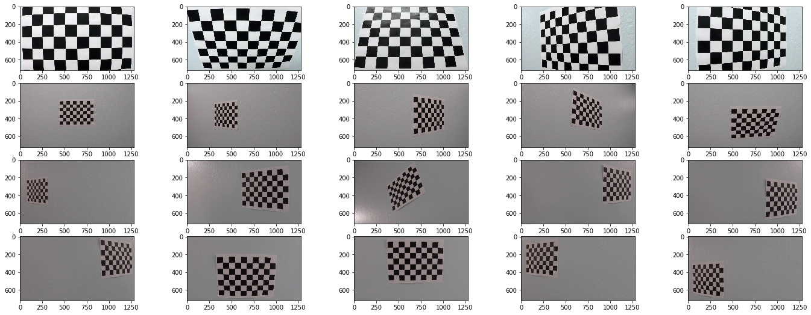

#### Camera Calibration

    Images after plotting chessboard corners
    
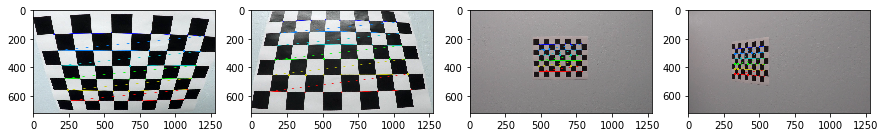

    Original and calibrated images

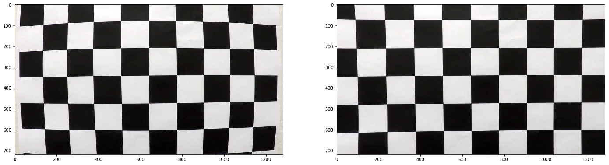

#### Undistortion

    Some Images after Distortion Correction. These are some examples of the undistorted Images

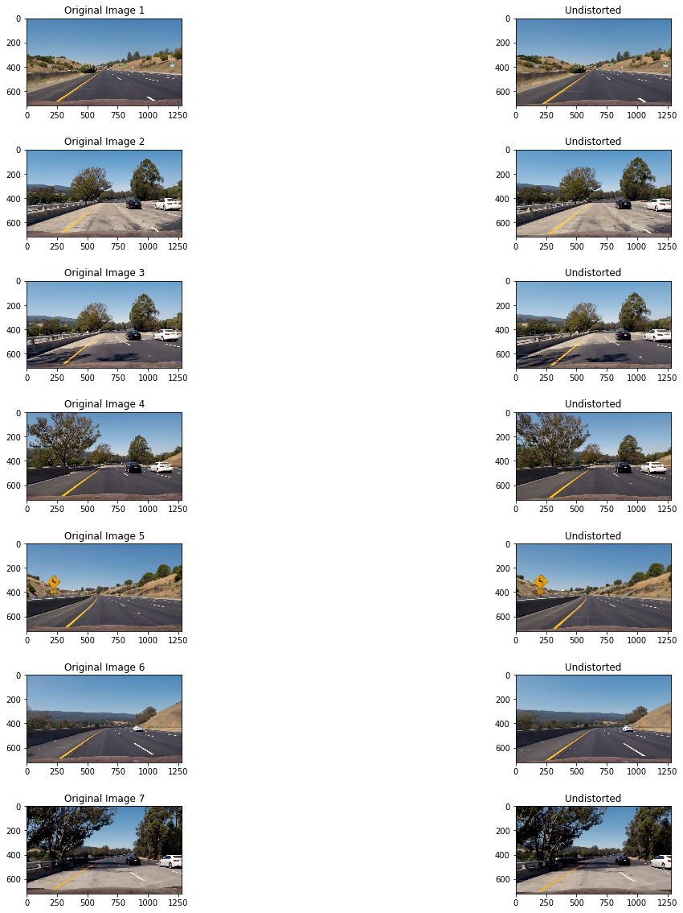

#### Perspective transform

    Warping the Images leads to bird's eye view of the lane. 
    These are some examples of the perspective transformed Images

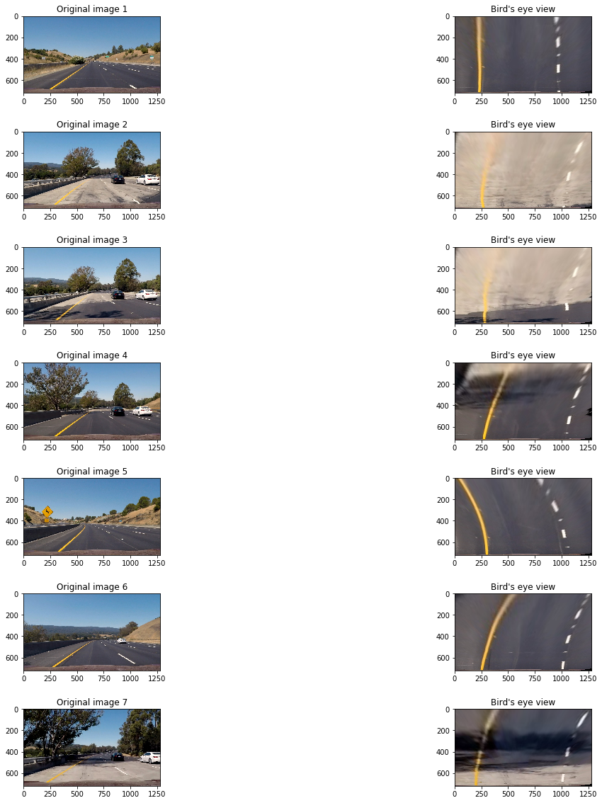

#### Experimenting on various color spaces
    
I tried converting the Image to various color spaces for detecting the lane lines better. I tried RGB, HSV, HLS, Lab and YCrCb color spaces.
    

    

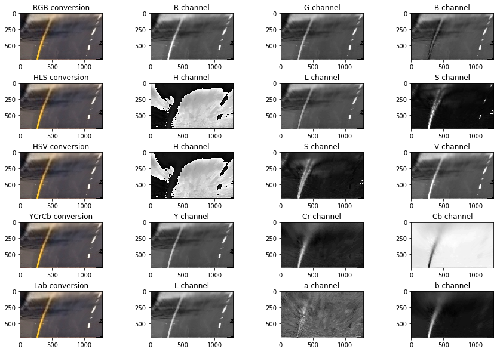

Out of the all the channels visualized above, S and L channel from HLS, Y and Cr channel from YCrCb colorspace look promising and are able to identify the lane lines easily, which are too bright to identify in the original image itself.
I chose these color channels because after combining they were easily able to detect the lane lines and were almost free from noise.

#### Experimenting with selected color channels (Y,Cr,L and S)

I tried to experiment more with the selected color channels just to be sure that they work on all kind of Imgaes, whether bright or dark or with shadows. I tried images with different road texture too.
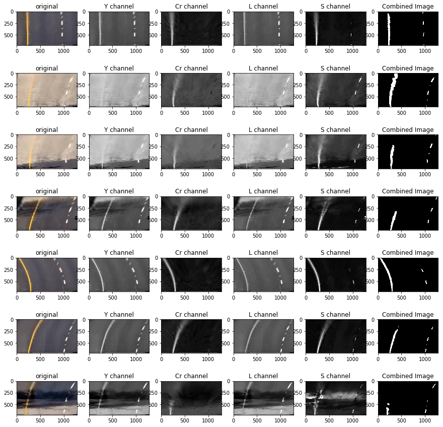

#### Sobel x and y

I experimented on Sobel operator to check if it helps in identifying the lane lines. These are some examples of Sobel x applied on the warped images

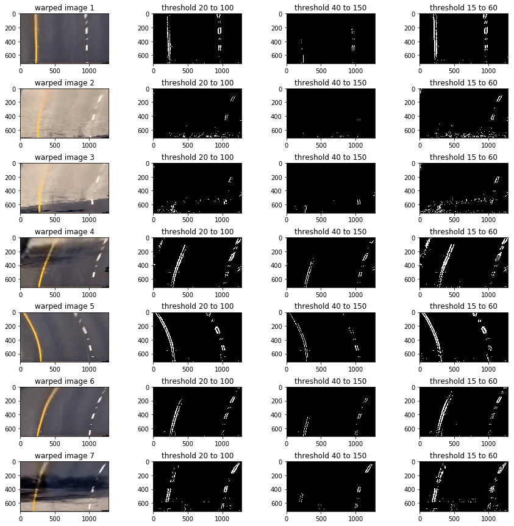

If Images are not properly warped, the left lane line is completely getting misidentified. Sobel identifies road edge as the lane line. This is due to the low contrast between lane line and the bright road in these two images. However this gets better after removing the road edge from the warped picture.

#### Sobel magnitude

These are some pictures of experimentation on the warped Images using sobel magnitude

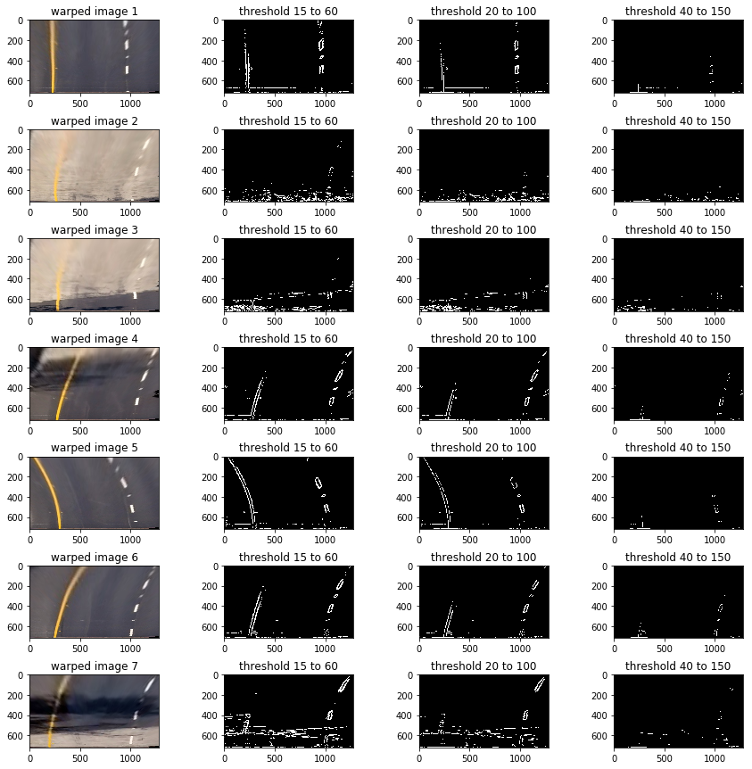

    I can't see any improvement in lane detection using sobel magnitude also. 
    Sobel is not able to detect low contrast lane lines and hence will might 
    fail in bright road conditions.

#### Sobel Gradient

These are some images of experimentation using sobel gradient. I tried to filter out some noise using the arctan operator to reduce the near horizontal lines from the Image, however this introduced a lot of noise of its own. 

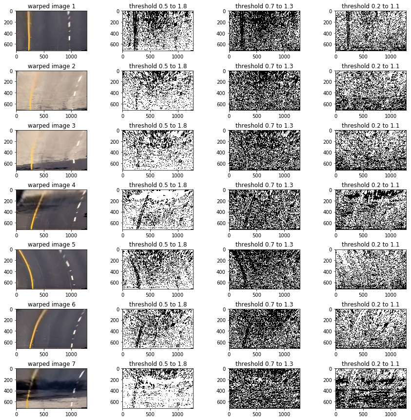

    Gradient sobel in itself doesn't looks good enough to detect lane lines.
    Also there is lot of noise in the images. I'll further try to combine the sobel 
    techniques along with the color channels to detect lane lines better and to suppress
    the detection of road edges in bright as well as dark conditions.

#### Combining Sobel with appropriate channels

I tried combining sobel techniques and channel thresholds to get the binary image of detected lanes but finally deduced that lanes get detected best using the color channels and hence went with channel thresholding for lane detection.

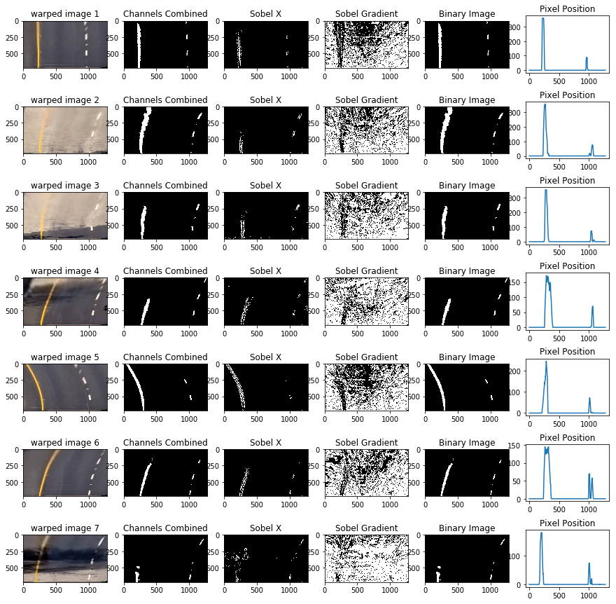

#### Fitting line on detected lanes and plotting windows 

I used the sliding window approach for detecting the lane lines and used Udacity's code for plotting the lines on the test Images.
These are some examples for the lane detected test images.

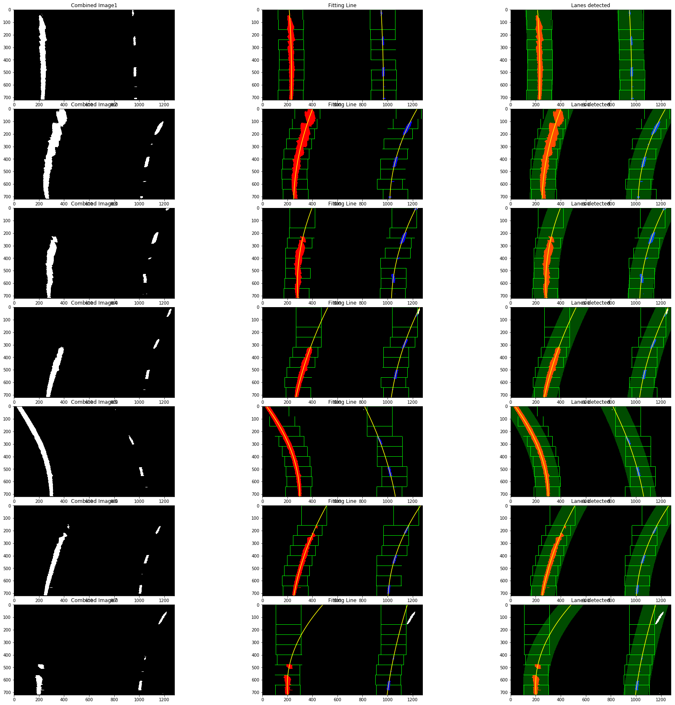

##### I followed the following steps for getting the line fitted on the lanes
    1. getting a histogram sum of the image pixel values
    2. getting the starting position of both lanes from the left and right half of histogram.
    3. divide the image into n steps and move two windows seperately over the starting 
       points of the lanes
    4. for each window we Identify the nonzero pixels in x and y within the window
    5. then we Append these indices to the lists
    6. recenter the window to the mean of the previous window's non-zero pixels.
    7. then after all the window steps, we extract the x and y location of the total selected pixels 
       and fit a second order polynomial to them.
    8. Then we fit a line to it using the formula Ax^2 + Bx + C
    9. The last step is to plot these lines using any suitable python libraries.
    10. We can also plot the windows using the cv2.rectangle() method.

#### Calculation of radius, position of car from center, direction etc.

Radius of curvature:

    R= ((1+(2Ay+B)^2)^(3/2))/abs(2A) - Formula for radius of curvature.
    However I used this formula after changing the x and y values to real world
    dimensions using the assumption 
    
    ym_per_pix = 30/720 # meters per pixel in y dimension
    xm_per_pix = 3.7/700 # meters per pixel in x dimension

Position of car from center:
    
    To find the position of car from center of the lane we need 2 things:
    1. The car position- which is the center of the Image's horizontal dimension
    2. Lane center- which can be found by taking the average of the x coordinates
       of the left and right lane lines.
    Once we get these two values we take there difference to get the deviation of the 
    car from the center of the lane.

Direction of steer:
    
    If car's x position is less than the lane center's x position, it's steering left
    Otherwise it's steering right. Simple

#### Pipeline
Pipeline is necessary to join all the code segments to take in an image and give a final output image which has the lane plotted on it.
Steps included in my image processing pipeline:
     
     1. Undistort the image from the pre-generated distortion correction matrix, we generated
        using chessboard images.
     2. warp the image(perspective transform)
     3. Do the channel thresholding, sobel(magnitude/gradient) thresholding etc.
     4. Get a binary Image with these filters applied on it.
     5. Plot the lane lines
     6. fill the lane with the color as is required and calculate the radius of curvature, position of car etc.
     7. Unwarp the Image using the inversion matrix
     8. Combine both the original and lane marked Image to get the final output.
     9. mark details on the image like the radius of curvature, position of car etc.
     10. return the Image.

Below are few examples of the test images processed by the pipeline.

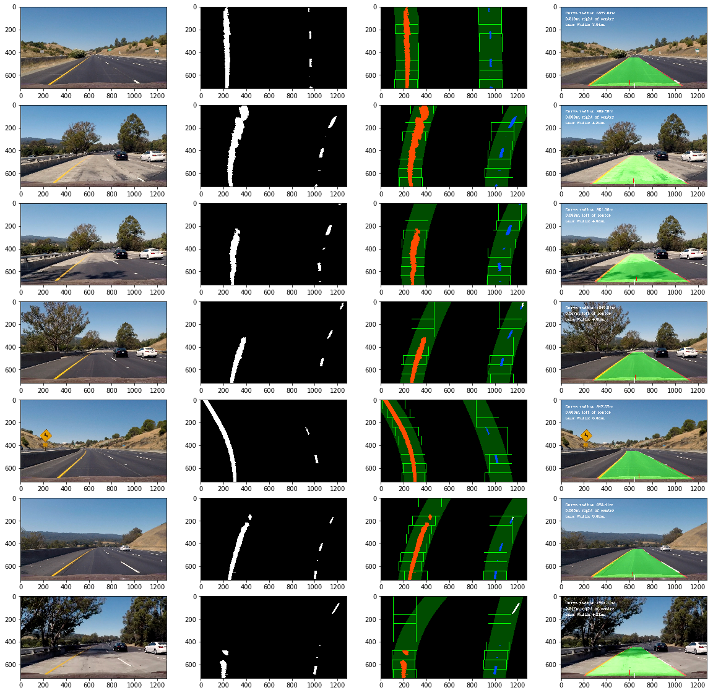

#### Bad frames:
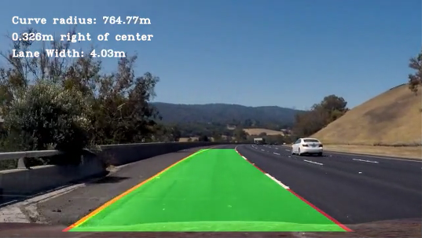
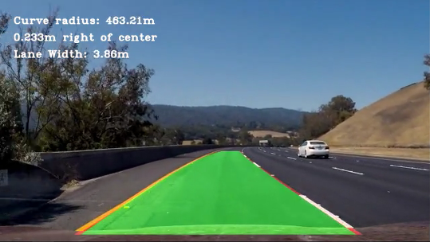
