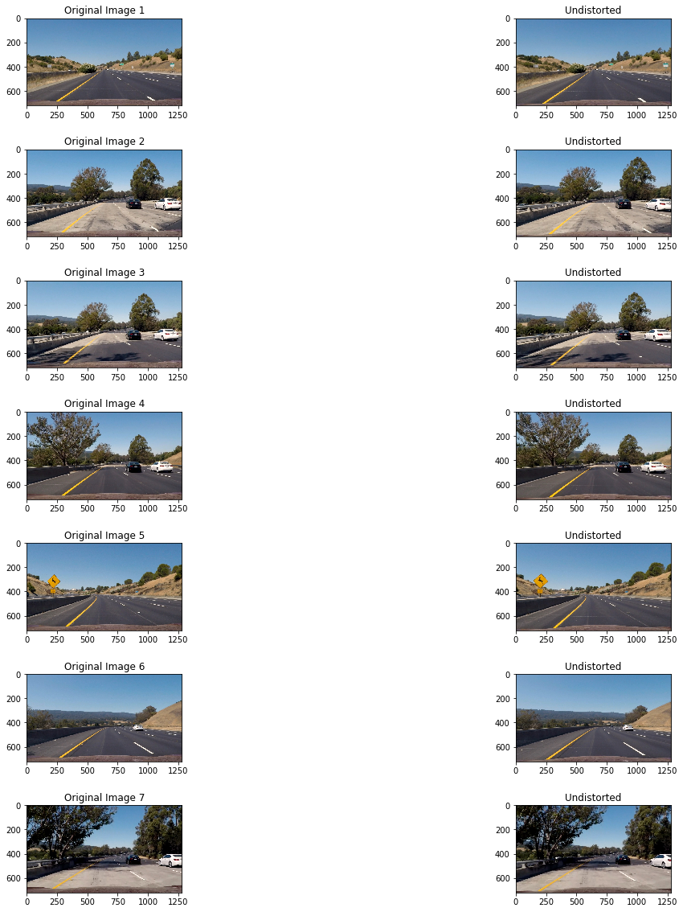
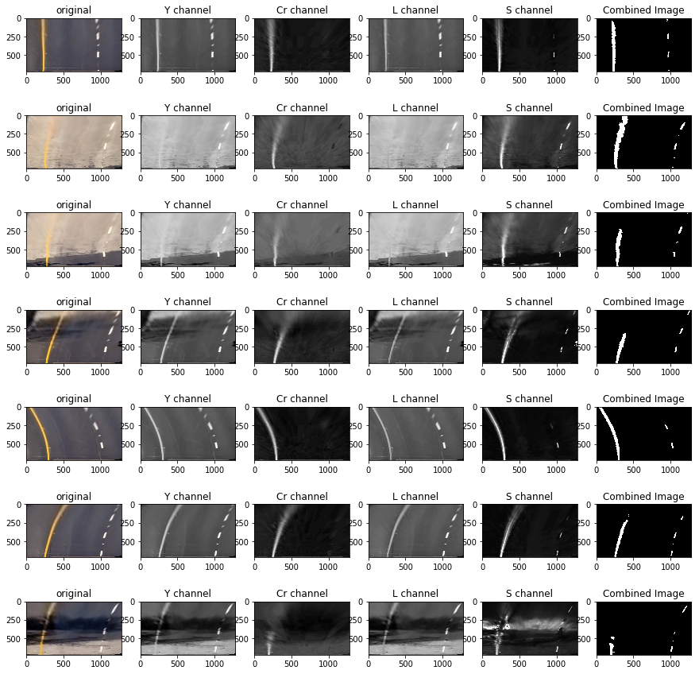
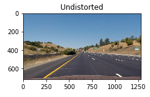
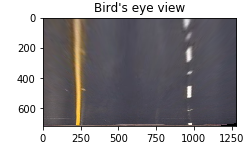
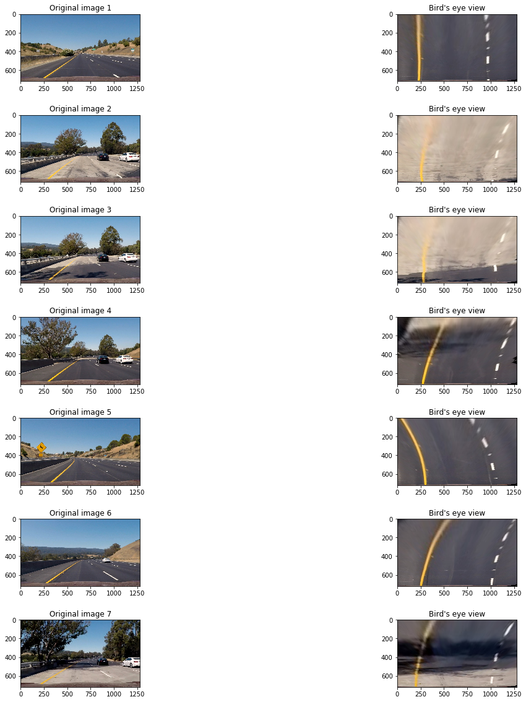
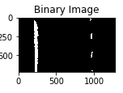
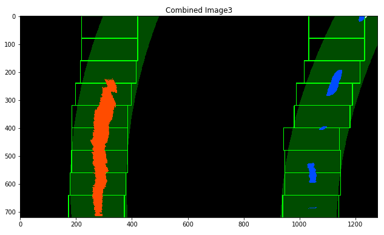
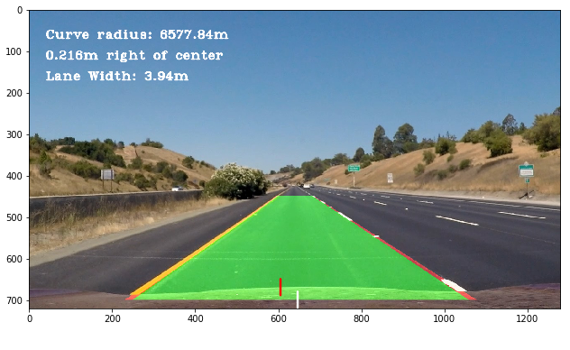
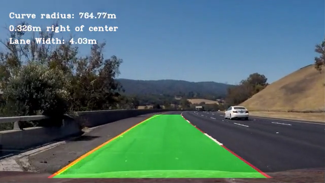
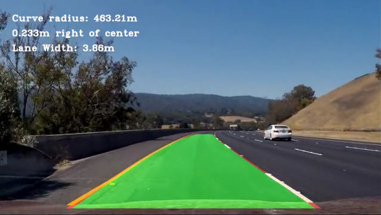

## Advanced Lane Line Detection 

This project uses in-depth Image processing, sliding window algorithm and basic math. The flow of the project is to read the images, undistort them and warp them to bird's eye view. Then we try to extract the lanes as much as possible and suppress the environment noise. We try to fit lines on both the lanes and fill in the region in between. Then we unwarp and combine both original and unwared lane image. to get the final result.

The first step in this process is to undistort the camera.

#### Distorted Chess Board Images
    

#### Camera Calibration
Camera Calibration is a necessary step before processing Images taken by the camera.
Every Camera has some irregularities and tend to distort images to some extent. This can be due to the uneven curvature,
material of lens, environment irregularities etc.

So after loading the images we calibrate the camera with them. Open CV provides some handy functions like findChessboardCorners, drawChessboardCorners and calibrateCamera to help us do this.

    Images after plotting chessboard corners
    

    Original and calibrated images

#### 1. Briefly state how you computed the camera matrix and distortion coefficients. Provide an example of a distortion corrected calibration image.
To calibrate the camera, First of all I imported the chessboard Images, and found their corners using the findChessboardCorners method. I also initialized the obj point as objp[:,:2]= np.mgrid[0:nx,0:ny].T.reshape(-1,2)

I kept finding corners and appended them to an array imgpoints and obj point to an array objpoints. Then I provided these as input to the calibrateCamera method, which returned a matrix. This matrix can now be used to undistort any image using the undistort method of OpenCV. This code is written in the cell 4 of my python notebook.

#### Undistortion
In cell 6 I used the same matrix to undistort some test Images too
These are some Images after Distortion Correction.

#### Experimenting on various color spaces
    
I tried converting the Image to various color spaces for detecting the lane lines better. I tried RGB, HSV, HLS, Lab and YCrCb color spaces.
    

Out of the all the channels visualized above, S and L channel from HLS, Y and Cr channel from YCrCb colorspace look promising and are able to identify the lane lines easily, which are too bright to identify in the original image itself.
I chose these color channels because after combining they were easily able to detect the lane lines and were almost free from noise.

#### Experimenting with selected color channels (Y,Cr,L and S)

I tried to experiment more with the selected color channels just to be sure that they work on all kind of Imgaes, whether bright or dark or with shadows. I tried images with different road texture too.

#### Sobel x and y

I experimented on Sobel operator to check if it helps in identifying the lane lines. These are some examples of Sobel x applied on the warped images

If Images are not properly warped, the left lane line is completely getting misidentified. Sobel identifies road edge as the lane line. This is due to the low contrast between lane line and the bright road in these two images. However this gets better after removing the road edge from the warped picture.

#### Sobel magnitude

These are some pictures of experimentation on the warped Images using sobel magnitude

    I can't see any improvement in lane detection using sobel magnitude also. 
    Sobel is not able to detect low contrast lane lines and hence will might 
    fail in bright road conditions.

#### Sobel Gradient

These are some images of experimentation using sobel gradient. I tried to filter out some noise using the arctan operator to reduce the near horizontal lines from the Image, however this introduced a lot of noise of its own. 

    Gradient sobel in itself doesn't looks good enough to detect lane lines.
    Also there is lot of noise in the images. I'll further try to combine the sobel 
    techniques along with the color channels to detect lane lines better and to suppress
    the detection of road edges in bright as well as dark conditions.

#### Combining Sobel with appropriate channels

I tried combining sobel techniques and channel thresholds to get the binary image of detected lanes but finally deduced that lanes get detected best using the color channels and hence went with channel thresholding for lane detection.

#### Pipeline
Pipeline is necessary to join all the code segments to take in an image and give a final output image which has the lane plotted on it.

Steps included in my image processing pipeline:
     
     1. Undistort the image from the pre-generated distortion correction matrix, we generated
        using chessboard images.
     2. warp the image(perspective transform)
     3. Do the channel thresholding, sobel(magnitude/gradient) thresholding etc.
     4. Get a binary Image with these filters applied on it.
     5. Plot the lane lines
     6. fill the lane with the color as is required and calculate the radius of curvature, position of car etc.
     7. Unwarp the Image using the inversion matrix
     8. Combine both the original and lane marked Image to get the final output.
     9. mark details on the image like the radius of curvature, position of car etc.
     10. return the Image.

#### stages in the pipeline:

#### 1. Provide an example of a distortion-corrected image.

To undistort the image I used the same matrix created by the cv2.calibrateCamera method. cv2.undistort method is used for undistorting and image.

#### 2. Describe how (and identify where in your code) you performed a perspective transform and provide an example of a transformed image.
For warping the Image I created a function called warp_image() in the cell 7 of notebook. This uses the value of src and dst which I have defined to be 

    Warping the Images leads to bird's eye view of the lane. 
    These are some examples of the perspective transformed Images
    

| Source        | Destination   | 
|:-------------:|:-------------:| 
| 593, 450      | 200, 0        | 
| 700, 450      | 1280-200, 0   |
| 1200, 700     | 1280-200, 720 |
| 200, 700      | 200, 720      |

I took 200 as the offset value to zoom in or zoom out the image on the x axis.

    def warp_image(img):
        img_size = (img.shape[1], img.shape[0])
        M= cv2.getPerspectiveTransform(src, dst) 
        inv= cv2.getPerspectiveTransform(dst, src)
        warped= cv2.warpPerspective(img, M, img_size, flags=cv2.INTER_LINEAR)
        return warped,inv

I verified that my perspective transform was working as expected by drawing the `src` and `dst` points onto a test image and its warped counterpart to verify that the lines appear parallel in the warped image.

#### 3. Describe how (and identify where in your code) you used color transforms, gradients or other methods to create a thresholded binary image.  Provide an example of a binary image result.

I used some color transforms like RGB2HLS and RGB2YCrCb. I tried with various color spaces but then selected a total of 4 filters in these 2 colorspaces. Here is a binary Image of the combined color channels

    def Custom_channel_converter(img):
        img1=cv2.cvtColor(img,cv2.COLOR_RGB2YCrCb)[:,:,0] # Y channel
        img2=cv2.cvtColor(img,cv2.COLOR_RGB2YCrCb)[:,:,1] #Cr channel
        img3=cv2.cvtColor(img,cv2.COLOR_RGB2HLS)[:,:,1] #L channel
        img4=cv2.cvtColor(img,cv2.COLOR_RGB2HLS)[:,:,2] #S channel
        return img1, img2, img3, img4
    
    
    Ybinary= channelwise_thresholding(imgY,(215,255))
    Crbinary= channelwise_thresholding(imgCr,(215,255))
    Lbinary= channelwise_thresholding(imgL,(215,255))
    Sbinary= channelwise_thresholding(imgS,(215,255))
    combinedImage= np.zeros_like(Ybinary)
    combinedImage[(Crbinary==1)|(Ybinary==1)|((Lbinary==1)&(Sbinary==1))]=1

This code is written in cell 10 of the notebook

#### 4. Describe how (and identify where in your code) you identified lane-line pixels and fit their positions with a polynomial?

I created a **plot_line()** function in the code to find the lane pixels using the sliding window approach and to fit a line to them. 

##### I followed the following steps for getting the line fitted on the lanes
    1. getting a histogram sum of the image pixel values
    2. getting the starting position of both lanes from the left and right half of histogram.
    3. divide the image into n steps and move two windows seperately over the starting 
       points of the lanes
    4. for each window we Identify the nonzero pixels in x and y within the window
    5. then we Append these indices to the lists
    6. recenter the window to the mean of the previous window's non-zero pixels.
    7. then after all the window steps, we extract the x and y location of the total selected pixels 
       and fit a second order polynomial to them.
    8. Then we fit a line to it using the formula Ax^2 + Bx + C
    9. The last step is to plot these lines using any suitable python libraries.
    10. We can also plot the windows using the cv2.rectangle() method.
    

#### 5. Describe how (and identify where in your code) you calculated the radius of curvature of the lane and the position of the vehicle with respect to center.

I used the sliding window approach for detecting the lane lines and used Udacity's code for plotting the lines on the test Images.
These are some examples for the lane detected test images.

#### Calculation of radius, position of car from center, direction etc.

Radius of curvature:

    R= ((1+(2Ay+B)^2)^(3/2))/abs(2A) - Formula for radius of curvature.
    However I used this formula after changing the x and y values to real world
    dimensions using the assumption 
    
    ym_per_pix = 30/720 # meters per pixel in y dimension
    xm_per_pix = 3.7/700 # meters per pixel in x dimension

Position of car from center:
    
    To find the position of car from center of the lane we need 2 things:
    1. The car position- which is the center of the Image's horizontal dimension
    2. Lane center- which can be found by taking the average of the x coordinates
       of the left and right lane lines.
    Once we get these two values we take there difference to get the deviation of the 
    car from the center of the lane.

Direction of steer:
    
    If car's x position is less than the lane center's x position, it's steering left
    Otherwise it's steering right. Simple

#### 6. Provide an example image of your result plotted back down onto the road such that the lane area is identified clearly.

Below are few examples of the test images processed by the pipeline.

#### Bad frames:
The pipeline was not able to detect the lane lines properly at the farther end of the lane.
It flickered a little at the top left corner of the lane.

#### Problems faced during the project
There were a lot of challenges in the project. I have enlisted some of them with the solutions I found for them.

1. **Too much Noise:** - I experimented on various color channels and selected the ones with the least noise.
2. **Radius, Position, lane values changing frequently** - I applied averaging/smoothening over past few frames using queues to suppress the sudden changes in values.
3. **Plotted Lane adjusting too slow to the changes** - This came as a side effect of smoothening. If averaging is done over large no.      of frames. It makes the response slow, so I decreased the value of the previous frames being considered.

####PipeLine(video)

Please find the link to the output video:

https://github.com/UjjwalSaxena/CarND-Advanced-Lane-Lines-master/blob/master/project_video_output.mp4
